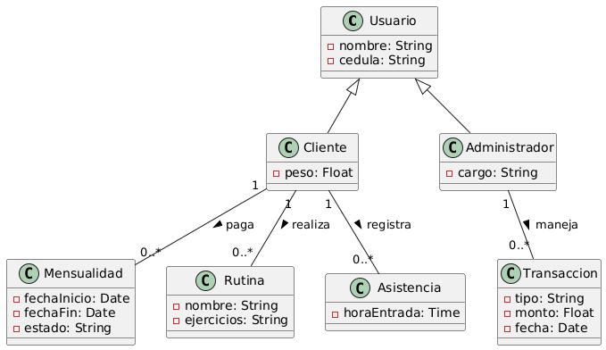

# Taller 5 · Diagrama de clases

- **Entrega:** en el **repositorio del equipo en GitHub**, diligenciando el enunciado con los puntos 2, 3 y 4 y subiendo el diagrama al repositorio *(imagen exportada o fuente PlantUML/draw.io)*.
- **Requisito previo:** diagrama de casos de uso del Taller 4.
- Herramienta: draw.io, PlantUML, StarUML o Visual Paradigm.

---

## 1. Guía mínima

**Diagrama de clases:** vista estructural del sistema. Muestra qué cosas existen en el dominio, qué datos guardan, qué saben hacer y cómo se relacionan. No muestra orden ni tiempo: eso es de los diagramas de secuencia.

### Clase

```bash
┌──────────────────────┐
│       Turno          │  ← nombre: sustantivo singular, del vocabulario del dominio
├──────────────────────┤
│ - fecha: Fecha       │  ← atributos: visibilidad nombre: tipo
│ - estado: EstadoTurno│
├──────────────────────┤
│ + cancelar(): void   │  ← métodos: visibilidad nombre(parámetros): retorno
└──────────────────────┘
```

- **Visibilidad:** `+` pública, `-` privada, `#` protegida, `~` de paquete. Los atributos van privados por defecto.
- En el **modelo de dominio** se pueden omitir los métodos: importan los conceptos, sus datos y sus relaciones.
- Una clase **no es una pantalla, una tabla ni un botón**. `PantallaLogin` o `BotonGuardar` no son conceptos del dominio.

### Relaciones

| Relación        | Notación                                  | Se lee                           | Ejemplo                  |
| --------------- | ----------------------------------------- | -------------------------------- | ------------------------ |
| **Asociación**  | línea simple                              | "A se relaciona con B"           | Cliente — Turno          |
| **Agregación**  | rombo vacío en el todo                    | "A tiene B, pero B existe sin A" | Barbería ◇— Barbero      |
| **Composición** | rombo lleno en el todo                    | "B es parte de A y muere con A"  | Factura ◆— LíneaFactura  |
| **Herencia**    | flecha con triángulo vacío hacia el padre | "B es un tipo de A"              | Usuario ◁— Administrador |
| **Dependencia** | flecha punteada                           | "A usa a B de paso"              | Reporte ⇢ Turno          |

- Ante la duda entre agregación y composición: si al borrar el todo **las partes no tienen sentido solas**, es composición.
- Herencia solo si el hijo **es un** padre y comparte su comportamiento. Si solo comparten un campo, no es herencia.

### Multiplicidad

Se escribe en cada extremo de la relación: cuántos objetos de ese lado se relacionan con **uno** del otro.

| Notación | Significa |
| --- | --- |
| `1` | exactamente uno |
| `0..1` | cero o uno |
| `*` o `0..*` | cero o muchos |
| `1..*` | uno o muchos |

- `Cliente 1 —— 0..* Turno`: un cliente tiene cero o muchos turnos; cada turno es de exactamente un cliente.
- Una relación sin multiplicidad está incompleta.

### Navegabilidad

- Flecha abierta en un extremo: desde A se llega a B, pero no al revés.
- En el modelo de dominio se puede dejar sin flecha *(bidireccional)*; se decide en el diseño.

### Cómo encontrar las clases

1. Subrayar los **sustantivos** del catálogo de requisitos y de las descripciones de los casos de uso.
2. Descartar sinónimos, atributos disfrazados *(el "nombre" no es una clase)*, actores que no guardan datos y cosas fuera del alcance.
3. Lo que queda son **clases candidatas**. Los **verbos** entre ellas sugieren relaciones.

---

## 2. Clases candidatas

| Clase candidata | Fuente *(RF o caso de uso)* | ¿Se queda? | Por qué |
| --- | --- | --- | --- |
| Cliente / Miembro | RF-01, CU-13 | Sí | Es un concepto central. Realiza pagos, tiene rutinas y asiste al gym. |
| Mensualidad | RF-01, RF-02 | Sí | Guarda los datos del pago, fecha de vencimiento y estado (activo/inactivo). |
| Rutina | RF-03, CU-08 | Sí | Contiene los detalles de los ejercicios asignados al cliente. |
| Administrador | CU-05, CU-09 | Sí | Usuario con permisos especiales. Gestiona los ingresos y asigna rutinas. |
| Transacción (Gasto/Ingreso) | RF-05, RF-06, CU-05 | Sí | Es obligatoria para visualizar el libro contable y hacer reportes. |
| Asistencia (Ingreso al gym) | RF-10, RF-11, CU-06 | Sí | Guarda la hora de entrada de un cliente para calcular el aforo y las horas pico. |
| Aforo | RF-10 | No | No guarda datos propios, es un cálculo/métrica que se saca contando las asistencias. |
| Alerta / Notificación | RF-09, CU-11 | No | Es una acción del sistema (un evento o mensaje), no necesita ser una entidad fija almacenada. |

- **Mínimo 6 clases** que se quedan.
- Toda clase lleva fuente. Una clase que no sale de ningún requisito o caso de uso no está en el alcance.

---

## 3. Diagrama de clases del dominio

Un solo diagrama con:

- **Mínimo 6 clases**, con atributos y tipos.
- **Mínimo 5 relaciones**, cada una con multiplicidad en los dos extremos.
- Al menos **una composición o agregación** y, si el dominio lo justifica, una **herencia**.
- Nombres en el vocabulario del dominio *(el que salió de la elicitación del Taller 3)*.
- Si el proyecto tiene componente de IA, la **entidad que guarda el resultado** del modelo *(e.g. `SugerenciaIA` con fecha, entrada, salida y estado)*. El servicio que llama a la API **no** va en este taller.

**Imagen del diagrama de clases:**




## 4. Trazabilidad y dudas

**Columna de clase de la matriz**

| Requisito | Caso de uso | Clase(s) |
| --------- | ----------- | ------------- |
| RF-01 / 02| CU-13 (Consultar mensualidad) | Cliente, Mensualidad |
| RF-03 / 04| CU-08 / CU-09 (Manejo de Rutinas)| Cliente, Rutina, Administrador |
| RF-06 / 08| CU-05 / CU-12 (Pagos e ingresos) | Administrador, Transacción |
| RF-10     | CU-06 (Validar ingreso al gym) | Cliente, Asistencia |

- Cada caso crítico debe apoyarse en al menos una clase del diagrama.

**Dudas para la siguiente clase** *(lo que el equipo no pudo resolver solo)*:

- ¿Es correcto no haber creado una clase llamada "Aforo" y en su lugar calcularlo simplemente contando la cantidad de "Asistencias" que no tienen hora de salida?

---

## Ejemplo diligenciado

**2. Candidatas**

| Clase candidata | Fuente            | ¿Se queda? | Por qué                                                                   |
| --------------- | ----------------- | ---------- | ------------------------------------------------------------------------- |
| Cliente         | RF-01             | Sí         | Reserva y tiene turnos                                                    |
| Turno           | RF-01, CU-01      | Sí         | Concepto central del dominio                                              |
| Barbero         | RF-02             | Sí         | Atiende turnos; tiene agenda                                              |
| Agenda          | P1 *(entrevista)* | No         | Es la lista de turnos de un barbero en un día: una consulta, no una clase |
| CierreCaja      | RF-05             | Sí         | Guarda el total del día                                                   |
| Teléfono        | RF-01             | No         | Es un atributo de Cliente                                                 |

**3. Diagrama** *(extracto en PlantUML)*


**4. Trazabilidad:** RF-01 → CU-01 Reservar turno → Cliente, Turno, Barbero. RF-02 → CU-02 Marcar no asistido → Turno *(estado)*.